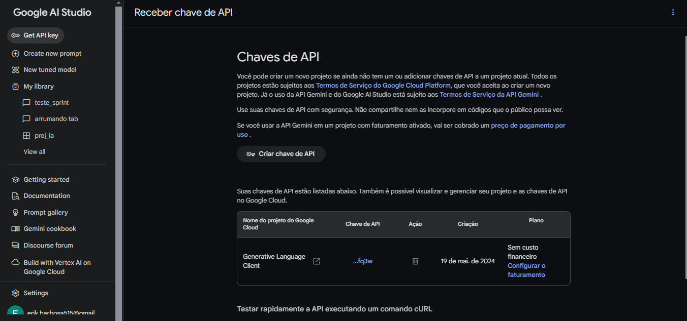

# TechPeach - Sistema Inteligente de Planejamento de Viagens em São Paulo

### Tenha uma chave API
No site do Google AI Studio

### Coloque sua chave de API no google colab

## Introdução
O TechPeach é um sistema inteligente desenvolvido para facilitar e personalizar o planejamento de viagens em São Paulo.

## Identificação do Problema
Planejar uma viagem pode ser complexo, especialmente quando se busca personalizar o itinerário com atividades e locais de interesse. Encontrar as melhores opções de atividades, restaurantes e pontos turísticos pode ser confuso e demorado.

## Nossa Solução
O sistema utiliza avaliações do Google Reviews para entender as preferências dos usuários e criar roteiros personalizados em São Paulo. Usando esses dados, o sistema aprende a identificar o que as pessoas gostam nos lugares que visitam.

## Evolução do Projeto
O projeto evoluiu desde sua concepção inicial até a criação de um protótipo funcional. Inicialmente, utilizávamos técnicas básicas de análise de dados, mas agora integramos algoritmos avançados de inteligência artificial para melhorar a personalização dos itinerários.

## Ferramentas e Recursos Utilizados
Para desenvolver nosso sistema, utilizamos diversas ferramentas e bibliotecas Python, incluindo:
- **Google Data Scraper**: Extrai avaliações de locais como museus, teatros, restaurantes, parques e locais de vida noturna em São Paulo.
- **Google AI Studio**: Organiza e limpa os dados das avaliações, focando nas colunas de nota e data.
- **Pandas**: Manipula dados e lê arquivos Excel.
- **Google Generative AI (Gemini)**: Gera respostas e interage com os dados para criar itinerários personalizados.

## Funcionamento dos Recursos na Aplicação
- **Data Scraper**: Extração de 45 avaliações de cada local selecionado, criando uma base de dados robusta.
- **Google AI Studio**: Organização e limpeza dos dados extraídos, preparando-os para processamento pela IA.
- **Pandas e Openpyxl**: Leitura e manipulação dos dados dos arquivos Excel contendo as avaliações.
- **Google Generative AI**: Treinamento com os dados limpos para gerar itinerários personalizados baseados nas preferências dos usuários.

## Uso de Machine Learning e IA

- **Google Generative AI (Gemini)**: Processa os dados e interage com os usuários, gerando respostas personalizadas com base nas avaliações extraídas.
- **Pandas**: Manipula os dados extraídos dos arquivos Excel, permitindo análise detalhada e preparação dos dados para treinamento do modelo.
- **Openpyxl**: Lê e extrai dados dos arquivos Excel.

## Exemplo Prático
O sistema inclui um chat interativo que entende as preferências dos usuários. Com base nas respostas sobre a viagem, como número de dias, interesses e orçamento, o sistema gera um itinerário personalizado com os melhores lugares avaliados para visitar, restaurantes e atividades.

## Conclusão
Nosso sistema visa tornar o processo de planejamento de viagens mais fácil e proporcionar experiências mais memoráveis e autênticas em São Paulo. Acreditamos que podemos inovar no mercado de turismo e proporcionar viagens mais personalizadas e satisfatórias para todos.

